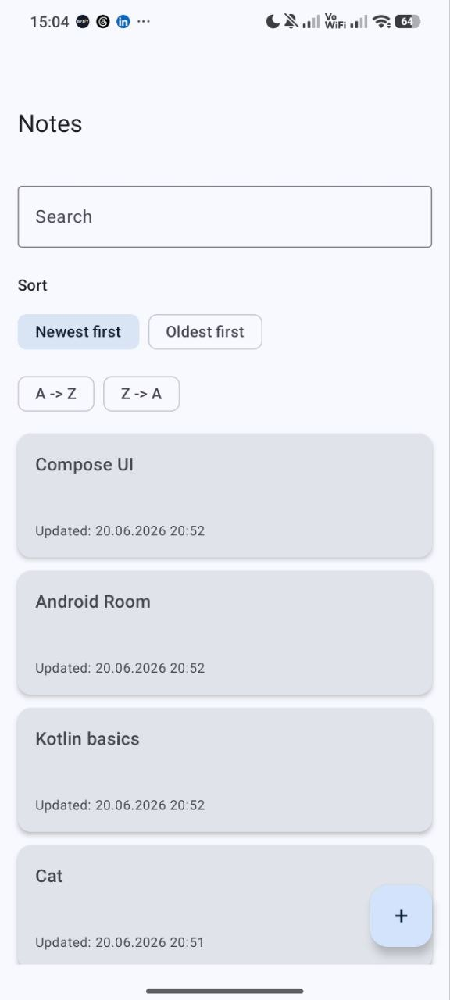
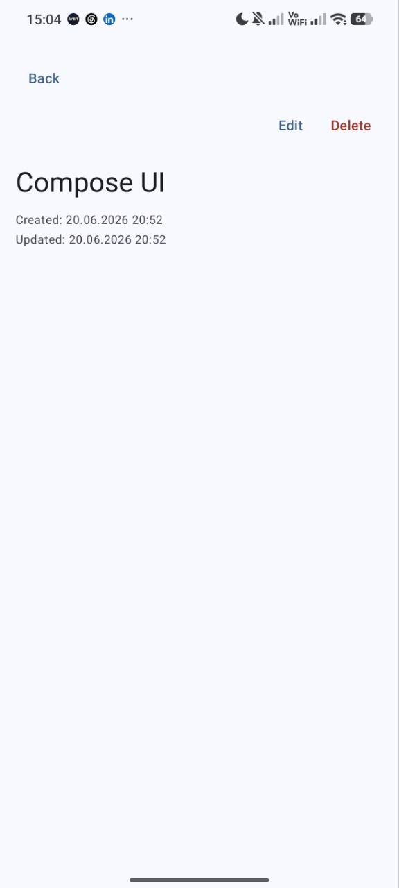
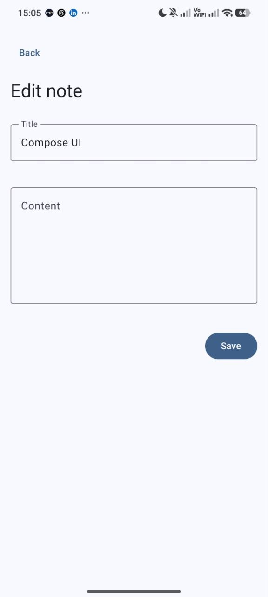
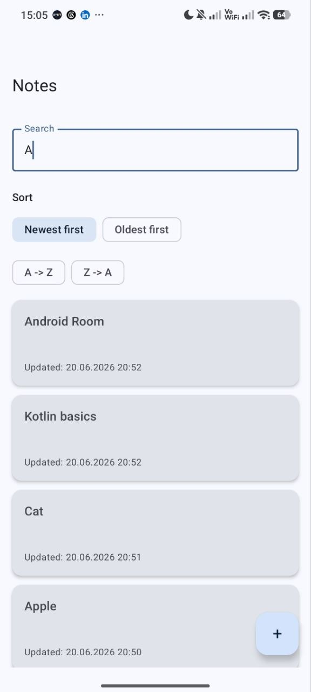
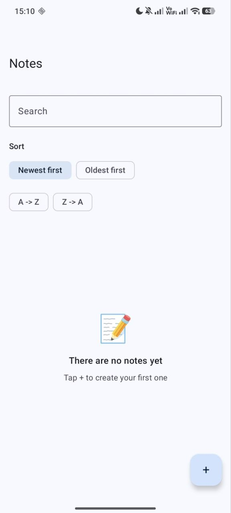
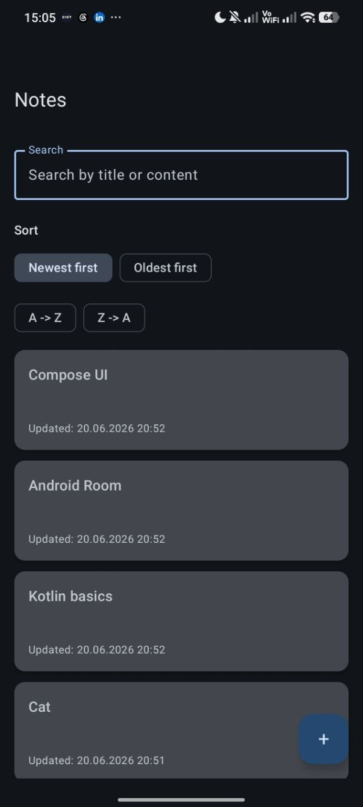

# Notes App

Notes App is a local Android application for creating, editing, deleting, searching, and sorting notes.  
The project was built as a Kotlin/Android pet-project to practice modern Android development with Jetpack Compose, Room, ViewModel, Flow/StateFlow, and Navigation Compose.

## Features

- Create notes
- Edit notes
- Delete notes
- Undo deleted notes
- Search notes by title and content
- Sort notes by date
- Sort notes by title
- Empty states for empty list and empty search results
- Local data storage with Room database
- Separate screens for notes list, note details, and note editing
- Navigation between screens with Navigation Compose
- Support for long notes
- Light and dark theme support

## Screenshots

> Add your screenshots to the `screenshots` folder and update the image paths if needed.

| Notes List                                | Note Details                                  | Edit Note                               |
|-------------------------------------------|-----------------------------------------------|-----------------------------------------|
|  |  |  |

| Search                            | Empty State                                 | Dark Theme                                |
|-----------------------------------|---------------------------------------------|-------------------------------------------|
|  |  |  |

## Tech Stack

- Kotlin
- Jetpack Compose
- Material 3
- Room Database
- Navigation Compose
- ViewModel
- Flow
- StateFlow
- Coroutines

## Architecture

The project follows a simple layered structure:

```text
data
 ├── local
 │   ├── dao
 │   ├── database
 │   └── entity
 └── repository

domain
 ├── model
 └── repository

presentation
 ├── notes
 ├── details
 └── edit

navigation